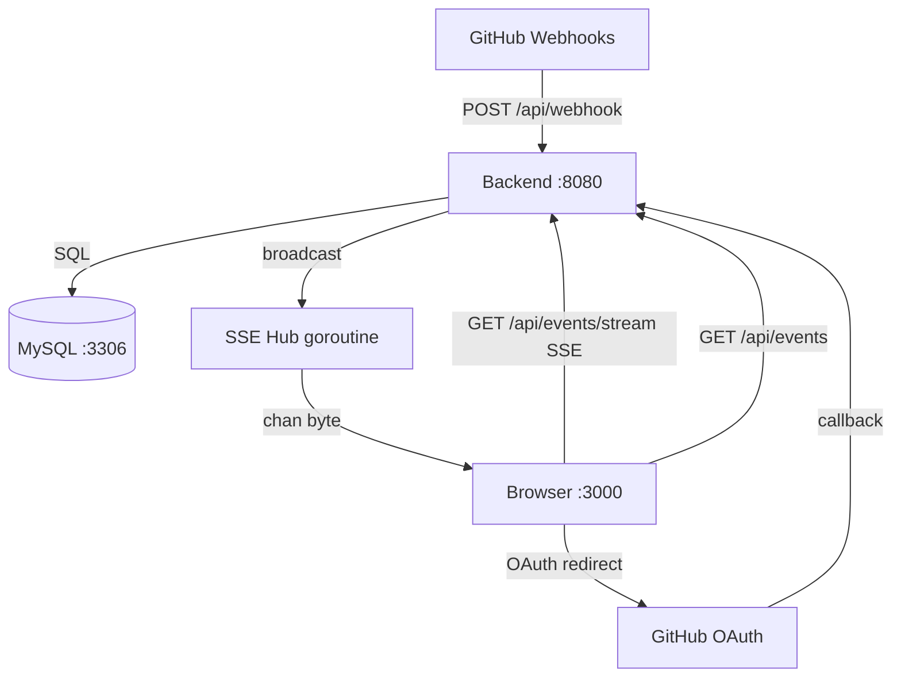
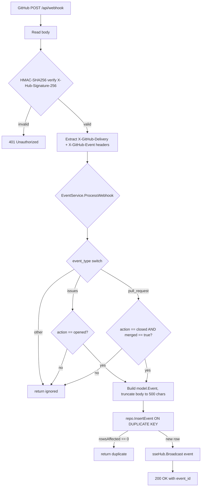
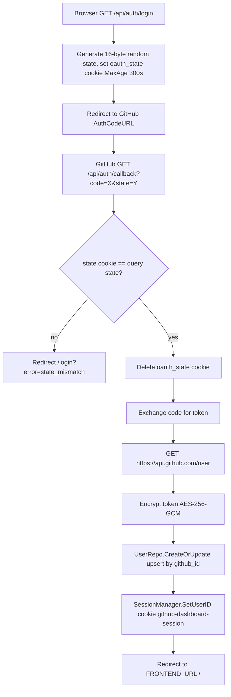
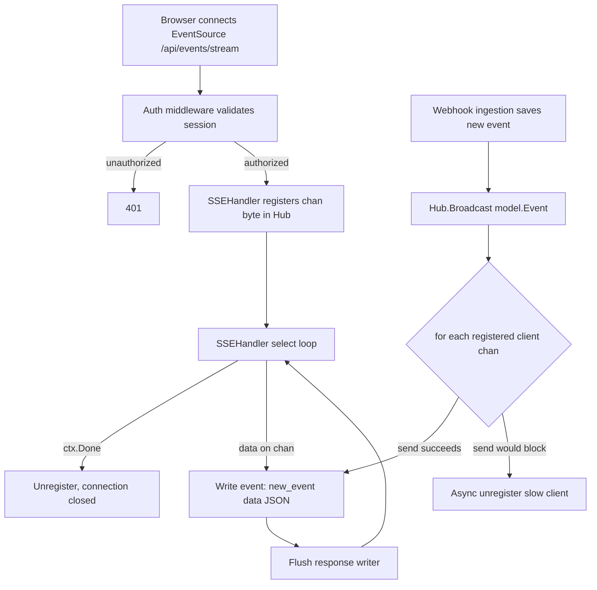
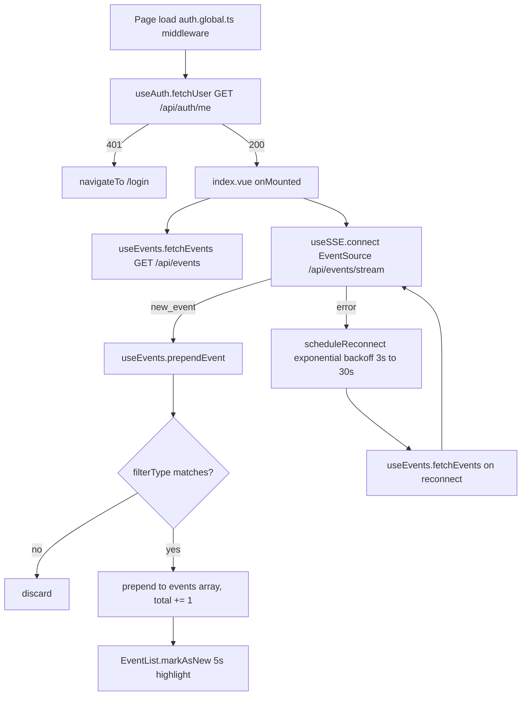

# Specification: GitHub Events Dashboard (Last Updated: 2026/02/20)

## Overview

GitHub Events Dashboard is a real-time webhook event viewer that captures and displays GitHub Issues and Pull Request events. The system receives webhook payloads from GitHub, persists qualifying events to a MySQL database, and streams new events to all connected browser clients via Server-Sent Events (SSE). Users must authenticate via GitHub OAuth before accessing the dashboard.

### Business Rules
- Only two event categories are captured: Issues with action `opened`, and Pull Requests with action `closed` AND `merged: true` (stored as action `merged`).
- All other event types and actions are silently ignored (status: `"ignored"`).
- Webhook delivery idempotency is enforced via `delivery_id` UNIQUE constraint; duplicates return status `"duplicate"` without re-broadcasting.
- Issue and PR body text is truncated to 500 characters before storage.
- GitHub OAuth tokens are encrypted at rest using AES-256-GCM before being written to the database.
- Session cookies expire after 24 hours (`MaxAge: 86400`).

---

## Architecture and Data Flow

### Component Topology



### Webhook Ingestion Flow



### Authentication Flow



### Real-Time SSE Flow



### Frontend State Flow



---

## Interface and Data Models

### Backend Go Models

#### `model.Event` (maps to `events` table)

```go
type Event struct {
    ID              int64      `json:"id"`
    DeliveryID      string     `json:"delivery_id"`   // GitHub X-GitHub-Delivery header; UNIQUE
    EventType       string     `json:"event_type"`    // "issues" | "pull_request"
    Action          string     `json:"action"`        // "opened" | "merged"
    RepoName        string     `json:"repo_name"`     // "owner/repo" format
    SenderLogin     string     `json:"sender_login"`
    SenderAvatarURL *string    `json:"sender_avatar_url"` // nullable
    Title           *string    `json:"title"`             // nullable, max 500 chars via DB VARCHAR(500)
    Body            *string    `json:"body"`              // nullable, truncated to 500 chars
    HTMLURL         string     `json:"html_url"`
    EventData       *string    `json:"event_data"`        // nullable JSON blob (reserved, not populated)
    OccurredAt      time.Time  `json:"occurred_at"`       // set to time.Now().UTC() at ingestion
    ReceivedAt      time.Time  `json:"received_at"`       // set to time.Now().UTC() at ingestion
    CreatedAt       time.Time  `json:"created_at"`
}
```

#### `model.EventListResponse`

```go
type EventListResponse struct {
    Events     []Event    `json:"events"`
    Pagination Pagination `json:"pagination"`
}

type Pagination struct {
    Page       int `json:"page"`
    PerPage    int `json:"per_page"`
    Total      int `json:"total"`
    TotalPages int `json:"total_pages"`
}
```

#### `model.WebhookResponse`

```go
type WebhookResponse struct {
    Status  string `json:"status"`            // "received" | "duplicate" | "ignored"
    EventID *int64 `json:"event_id,omitempty"` // set only when Status == "received"
}
```

#### `model.User` (maps to `users` table)

```go
type User struct {
    ID          int64     `json:"id"`
    GitHubID    int64     `json:"github_id"`    // UNIQUE
    Login       string    `json:"login"`        // UNIQUE
    DisplayName string    `json:"display_name"`
    AvatarURL   *string   `json:"avatar_url"`   // nullable
    AccessToken string    `json:"-"`            // never serialised; stored encrypted
    LastLogin   time.Time `json:"last_login"`
    CreatedAt   time.Time `json:"created_at"`
    UpdatedAt   time.Time `json:"updated_at"`
}

// UserResponse strips sensitive fields for API responses
type UserResponse struct {
    ID          int64   `json:"id"`
    Login       string  `json:"login"`
    DisplayName string  `json:"display_name"`
    AvatarURL   *string `json:"avatar_url"`
}
```

#### `config.Config` (environment-driven)

```go
type Config struct {
    GitHubClientID      string  // GITHUB_CLIENT_ID
    GitHubClientSecret  string  // GITHUB_CLIENT_SECRET
    GitHubWebhookSecret string  // GITHUB_WEBHOOK_SECRET
    MySQLHost           string  // MYSQL_HOST (default: "db")
    MySQLPort           int     // MYSQL_PORT (default: 3306)
    MySQLUser           string  // MYSQL_USER (required)
    MySQLPassword       string  // MYSQL_PASSWORD (required)
    MySQLDatabase       string  // MYSQL_DATABASE (required)
    BackendPort         int     // BACKEND_PORT (default: 8080)
    FrontendURL         string  // FRONTEND_URL (default: "http://localhost:3000")
    SessionSecret       string  // SESSION_SECRET
    TokenEncryptionKey  string  // TOKEN_ENCRYPTION_KEY (64 hex chars = 32 bytes AES-256)
}
```

### Frontend TypeScript Types

#### `types/event.ts`

```typescript
export interface Event {
  id: number
  delivery_id: string
  event_type: string          // "issues" | "pull_request"
  action: string              // "opened" | "merged"
  repo_name: string
  sender_login: string
  sender_avatar_url: string | null
  title: string | null
  body: string | null
  html_url: string
  event_data: Record<string, unknown> | null
  occurred_at: string         // ISO 8601
  received_at: string         // ISO 8601
}

export interface Pagination {
  page: number
  per_page: number
  total: number
  total_pages: number
}

export interface EventListResponse {
  events: Event[]
  pagination: Pagination
}
```

#### `useAuth` composable return type

```typescript
interface UseAuthReturn {
  user: Ref<User | null>         // { id, login, display_name, avatar_url }
  loading: Ref<boolean>
  isAuthenticated: Ref<boolean>
  fetchUser: () => Promise<void> // GET /api/auth/me; sets isAuthenticated
  login: () => void              // window.location.href = /api/auth/login
  logout: () => Promise<void>    // POST /api/auth/logout then navigateTo('/login')
}
```

#### `useEvents` composable return type

```typescript
interface UseEventsReturn {
  events: Ref<Event[]>
  pagination: Ref<Pagination>
  loading: Ref<boolean>
  error: Ref<string | null>
  selectedEvent: Ref<Event | null>
  filterType: Ref<string>
  fetchEvents: () => Promise<void>        // GET /api/events with page/per_page/event_type
  fetchEventById: (id: number) => Promise<void> // GET /api/events/:id
  setPage: (page: number) => void         // updates page then calls fetchEvents
  setFilter: (eventType: string) => void  // resets page to 1 then calls fetchEvents
  prependEvent: (event: Event) => void    // SSE handler; respects active filterType
}
```

#### `useSSE` composable return type

```typescript
interface UseSSEOptions {
  onNewEvent: (event: Event) => void
  onSessionExpired?: () => void
  onReconnect?: () => void
}

interface UseSSEReturn {
  connected: Ref<boolean>
  connect: () => void
  disconnect: () => void
}
// Reconnect delay: starts at 3000ms, doubles each failure, caps at 30000ms
// SSE event name listened to: "new_event"
// SSE event name listened to: "session_expired"
```

---

## API Reference

### Public Endpoints (no authentication required)

| Method | Path | Description |
|--------|------|-------------|
| GET | `/api/health` | Returns `{"status":"healthy","checks":{"database":"up"}}` or 503 |
| POST | `/api/webhook` | GitHub webhook receiver; requires `X-Hub-Signature-256` HMAC header |
| GET | `/api/auth/login` | Initiates GitHub OAuth; sets `oauth_state` cookie; redirects to GitHub |
| GET | `/api/auth/callback` | OAuth callback; validates state, exchanges code, creates session |
| GET | `/api/auth/me` | Returns `UserResponse` for the current session; 401 if not authenticated |
| POST | `/api/auth/logout` | Destroys session cookie; returns `{"status":"logged_out"}` |

### Protected Endpoints (session cookie `github-dashboard-session` required)

| Method | Path | Query Params | Description |
|--------|------|--------------|-------------|
| GET | `/api/events` | `page` (int, default 1), `per_page` (int, default 20, max 100), `event_type` (string) | Returns paginated `EventListResponse`; ordered by `received_at DESC` |
| GET | `/api/events/{id}` | — | Returns single `Event`; 404 if not found |
| GET | `/api/events/stream` | — | SSE stream; emits `new_event` with JSON `Event` body |

### Webhook Request Contract

```
POST /api/webhook
Headers:
  X-Hub-Signature-256: sha256=<HMAC-SHA256 of body using GITHUB_WEBHOOK_SECRET>
  X-GitHub-Delivery: <UUID>
  X-GitHub-Event: <issues|pull_request|...>
Content-Type: application/json
```

Response on success: `{"status":"received","event_id":42}` (HTTP 200)
Response on duplicate: `{"status":"duplicate"}` (HTTP 200)
Response on ignored type: `{"status":"ignored"}` (HTTP 200)

### SSE Stream Protocol

```
GET /api/events/stream
Headers:
  Content-Type: text/event-stream
  Cache-Control: no-cache
  Connection: keep-alive

Event format:
event: new_event
data: <JSON-serialised model.Event>

```

---

## Database Schema

### `events` table (migration: `001_create_events.sql`)

```sql
CREATE TABLE IF NOT EXISTS events (
    id              BIGINT AUTO_INCREMENT PRIMARY KEY,
    delivery_id     VARCHAR(36)  NOT NULL,
    event_type      VARCHAR(50)  NOT NULL,
    action          VARCHAR(50)  NOT NULL,
    repo_name       VARCHAR(255) NOT NULL,
    sender_login    VARCHAR(255) NOT NULL,
    sender_avatar_url TEXT,
    title           VARCHAR(500),
    body            TEXT,
    html_url        TEXT         NOT NULL,
    event_data      JSON,
    occurred_at     DATETIME     NOT NULL,
    received_at     DATETIME     NOT NULL DEFAULT CURRENT_TIMESTAMP,
    created_at      DATETIME     NOT NULL DEFAULT CURRENT_TIMESTAMP,
    UNIQUE KEY uq_delivery_id (delivery_id),
    INDEX idx_event_type (event_type),
    INDEX idx_received_at (received_at),
    INDEX idx_repo_name (repo_name)
) ENGINE=InnoDB DEFAULT CHARSET=utf8mb4 COLLATE=utf8mb4_unicode_ci;
```

Key design notes:
- `delivery_id` UNIQUE enforces idempotency; insert uses `ON DUPLICATE KEY UPDATE id = LAST_INSERT_ID(id)` and checks `RowsAffected == 0` to detect duplicates.
- `event_data` JSON column is reserved for future raw payload storage; currently always `NULL`.
- List queries always order by `received_at DESC`.

### `users` table (migration: `002_create_users.sql`)

```sql
CREATE TABLE IF NOT EXISTS users (
    id           BIGINT AUTO_INCREMENT PRIMARY KEY,
    github_id    BIGINT       NOT NULL,
    login        VARCHAR(255) NOT NULL,
    display_name VARCHAR(255),
    avatar_url   TEXT,
    access_token TEXT         NOT NULL,  -- AES-256-GCM encrypted, hex-encoded
    last_login   DATETIME     NOT NULL,
    created_at   DATETIME     NOT NULL DEFAULT CURRENT_TIMESTAMP,
    updated_at   DATETIME     NOT NULL DEFAULT CURRENT_TIMESTAMP ON UPDATE CURRENT_TIMESTAMP,
    UNIQUE KEY uq_github_id (github_id),
    UNIQUE KEY uq_login (login)
) ENGINE=InnoDB DEFAULT CHARSET=utf8mb4 COLLATE=utf8mb4_unicode_ci;
```

Key design notes:
- `access_token` is always AES-256-GCM encrypted before write; decrypted after read by `UserRepository`.
- Upsert on login uses `ON DUPLICATE KEY UPDATE` to refresh `login`, `display_name`, `avatar_url`, `access_token`, and `last_login`.

---

## Security Architecture

### HMAC Webhook Verification

The `WebhookHandler.verifySignature` method computes `HMAC-SHA256(body, GITHUB_WEBHOOK_SECRET)` and uses `hmac.Equal` for constant-time comparison against the `sha256=` prefixed value in `X-Hub-Signature-256`. Requests with missing or invalid signatures receive `401 Unauthorized`.

### AES-256-GCM Token Encryption

`crypto.TokenEncryptor` requires a 64-character hex-encoded key (32 bytes). Each `Encrypt` call generates a fresh random nonce; the output format is `hex(nonce + sealed_ciphertext)`. The nonce is prepended so `Decrypt` can extract it. The encryptor is initialised once at server start and shared via `UserRepository`.

### OAuth CSRF Protection

A 16-byte cryptographically random state value is set as an `HttpOnly`, `SameSite=Lax`, 300-second cookie named `oauth_state`. The callback handler validates the cookie value against the `state` query parameter before proceeding. The cookie is immediately cleared after validation regardless of outcome.

### Session Management

Session cookies are named `github-dashboard-session`, managed by `gorilla/sessions` with a `CookieStore` backed by `SESSION_SECRET`. Options: `Path=/`, `MaxAge=86400`, `HttpOnly=true`, `SameSite=Lax`. The `Auth` middleware extracts `user_id` from the session and places it in the request context under the `contextKey("user_id")` key.

### URL Allowlist Validation (XSS / Open Redirect Prevention)

All URLs rendered in the frontend pass through `utils/url.ts` validators before use:
- `safeGithubUrl`: requires `https://github.com/` prefix.
- `safeAvatarUrl`: requires `https://avatars.githubusercontent.com/` prefix.
Both return `null` for non-matching URLs; templates skip rendering or links when the value is `null`.

### CORS Policy

The `CORS` middleware sets `Access-Control-Allow-Origin` to the single value of `FRONTEND_URL` (not `*`). `Access-Control-Allow-Credentials: true` is set to allow the session cookie to be sent with cross-origin requests from the frontend.

Note: The SSE handler separately sets `Access-Control-Allow-Origin: *` as an override — this is a known inconsistency in the current codebase.

---

## Infrastructure and Configuration

### Docker Compose Services

| Service | Image / Build | Port | Purpose |
|---------|--------------|------|---------|
| `db` | `mysql:8.0` | 3306 | Primary datastore; healthcheck with `mysqladmin ping` |
| `backend` | `./backend` (target: `dev`) | `$BACKEND_PORT` (default 8080) | Go API server with Air hot-reload |
| `frontend` | `./frontend` | 3000 | Nuxt 3 SSR/SPA server |

Startup order: `db` (healthy) → `backend` → `frontend`.
Migrations in `db/migrations/` are mounted to `/docker-entrypoint-initdb.d` and run automatically on first `db` start.

### Database Connection Pool

```
MaxOpenConns:    10
MaxIdleConns:    5
ConnMaxLifetime: 5 minutes
```

DSN format: `user:pass@tcp(host:port)/database?parseTime=true&charset=utf8mb4`

### HTTP Server Timeouts

```
ReadTimeout:  15s
WriteTimeout: 15s
IdleTimeout:  60s
```

Graceful shutdown waits up to 10 seconds for in-flight requests to complete on `SIGINT`/`SIGTERM`.

### Required Environment Variables

| Variable | Required | Description |
|----------|----------|-------------|
| `GITHUB_CLIENT_ID` | Yes | GitHub OAuth App client ID |
| `GITHUB_CLIENT_SECRET` | Yes | GitHub OAuth App client secret |
| `GITHUB_WEBHOOK_SECRET` | Yes | Webhook HMAC secret (set in GitHub repo settings) |
| `MYSQL_USER` | Yes | MySQL username |
| `MYSQL_PASSWORD` | Yes | MySQL password |
| `MYSQL_DATABASE` | Yes | MySQL database name |
| `MYSQL_ROOT_PASSWORD` | Yes | MySQL root password (Docker only) |
| `TOKEN_ENCRYPTION_KEY` | Yes | 64 hex chars (32 bytes) for AES-256-GCM |
| `SESSION_SECRET` | Yes | Arbitrary string for gorilla/sessions HMAC |
| `MYSQL_HOST` | No | Default: `db` |
| `MYSQL_PORT` | No | Default: `3306` |
| `BACKEND_PORT` | No | Default: `8080` |
| `FRONTEND_URL` | No | Default: `http://localhost:3000` |
| `NUXT_PUBLIC_API_BASE` | No | Frontend runtime config; default: `http://localhost:8080` |

---

## Frontend Architecture Detail

### Nuxt 3 Configuration

- Modules: `@nuxtjs/tailwindcss`, `@pinia/nuxt`
- TypeScript strict mode enabled
- `runtimeConfig.public.apiBase` exposed to client; set via `NUXT_PUBLIC_API_BASE`
- All `$fetch` calls use `credentials: 'include'` to send session cookies cross-origin

### Route Guard (`middleware/auth.global.ts`)

Runs on every navigation. Calls `useAuth().fetchUser()` (which hits `GET /api/auth/me`) on every route change. This means each navigation makes a network round-trip to verify session validity.

- If on `/login` and authenticated: redirect to `/`
- If not on `/login` and not authenticated: redirect to `/login`

### Component Responsibilities

| Component | Props | Emits | Notes |
|-----------|-------|-------|-------|
| `AppHeader` | — | — | Calls `useAuth().fetchUser()` on mount; renders user avatar and logout button |
| `EventList` | `events: Event[]` | `select: Event` | Exposes `markAsNew(id)` via `defineExpose`; highlights new events for 5s with CSS animation |
| `EventDetail` | `event: Event \| null` | `close` | Validates all URLs via `safeGithubUrl`/`safeAvatarUrl` before rendering; shows placeholder when `event` is `null` |
| `EventFilter` | `modelValue: string` | `update:modelValue` | Three options: `''` (All), `'issues'`, `'pull_request'`; uses `v-model` pattern |
| `Pagination` | `page`, `totalPages`, `total` | `update:page` | Renders at most 5 visible page buttons; hidden if `totalPages <= 1` |

### SSE Reconnect Strategy

Initial delay: 3000ms. On each failed reconnect attempt, the delay doubles (`delay * 2`), capped at 30000ms. On successful reconnect, the delay resets to 3000ms. The `onReconnect` callback in `index.vue` calls `fetchEvents()` to re-sync the event list before the SSE stream resumes delivering live events. The `EventSource` instance is closed and nulled on error before scheduling a reconnect.

### New Event Highlight Lifecycle

1. SSE delivers `new_event`.
2. `prependEvent` adds the event to the front of `events` (if filter matches).
3. `eventListRef.value.markAsNew(event.id)` adds the ID to `newEventIds` Set.
4. `EventList` renders the event row with `ring-2 ring-blue-400 bg-blue-50 animate-pulse-once`.
5. After 5000ms, `markAsNew` removes the ID; the highlight disappears.

---

## Logging

All logs emit structured JSON to stdout. Two log patterns are used:

**HTTP request log** (emitted by `Logger` middleware after each request):
```json
{
  "timestamp": "2026-02-20T12:00:00Z",
  "method": "POST",
  "path": "/api/webhook",
  "status_code": 200,
  "duration": "1.234ms",
  "remote_addr": "1.2.3.4:5678"
}
```

**Application event log** (emitted by `middleware.LogEvent`):
```json
{
  "timestamp": "2026-02-20T12:00:00Z",
  "level": "info",
  "message": "event saved",
  "delivery_id": "abc-123",
  "event_id": 42,
  "event_type": "issues"
}
```

Log levels used: `"info"`, `"warn"`, `"error"`.

---

## Constraints and Implementation Rules

### Backend Rules

1. **Layer isolation**: Handlers must never access the database directly. Data access is always through `EventRepository` or `UserRepository`. Business logic (filtering, truncation, parsing) lives in `EventService`, not in handlers.

2. **Webhook idempotency**: Never remove the `ON DUPLICATE KEY UPDATE` pattern from `InsertEvent`. The `RowsAffected == 0` check is the sole mechanism for detecting duplicates. Do not add secondary lookup logic.

3. **Token encryption**: The `AccessToken` field on `model.User` is always the plaintext token in memory. Encryption and decryption happen exclusively in `UserRepository`. Never pass encrypted ciphertext through the `model.User` struct.

4. **SSE Hub concurrency**: The `Hub` struct uses a single-goroutine event loop (`Run()`) for all register/unregister/broadcast operations. The `clients` map must only be written in the `Run()` goroutine. The `sync.RWMutex` guards only reads (client iteration during broadcast). Do not add writes to `clients` outside the `Run()` select loop.

5. **HMAC verification**: Always use `hmac.Equal` for signature comparison (constant-time). Never use `==` or `bytes.Equal`.

6. **BroadcastFunc coupling**: `handler.BroadcastFunc` is a package-level `var` set in `main.go` that bridges `WebhookHandler` to `sse.Hub`. This is intentional to avoid a circular import. Do not restructure this without understanding the import graph.

7. **Error responses**: All JSON error responses must use the `ErrorResponse{Error: string}` struct and `writeError()` helper, not raw `http.Error()`.

8. **Config validation**: `TOKEN_ENCRYPTION_KEY`, `MYSQL_USER`, `MYSQL_PASSWORD`, and `MYSQL_DATABASE` are hard failures at startup. Do not add optional fallbacks for these.

9. **Graceful shutdown**: The server has a 10-second shutdown window. Long-running SSE connections will be cut off. Do not extend this timeout without considering the SSE client reconnect strategy.

### Frontend Rules

1. **URL safety**: Never render `event.html_url` or `event.sender_avatar_url` directly in templates. Always pass through `safeGithubUrl()` or `safeAvatarUrl()` from `~/utils/url.ts`. These return `null` for non-matching URLs; always guard with `v-if`.

2. **Credentials on all API calls**: Every `$fetch` call to the backend API must include `{ credentials: 'include' }` to send the session cookie in cross-origin requests.

3. **Composable pattern**: Do not use Pinia stores for `events`, `auth`, or `sse` state. The existing pattern is composable functions returning `Ref` values. New features must follow the same pattern. Pinia is available but not currently used for application state.

4. **Filter-aware prepend**: `prependEvent` must check `filterType.value` before adding an event. If a filter is active and the new event's `event_type` does not match, the event must be silently discarded (no total count increment).

5. **SSE lifecycle**: Call `disconnect()` in `onUnmounted` (already done in `useSSE`). Do not create new `EventSource` instances without closing the previous one. The `connect()` function always closes any existing `eventSource` before creating a new one.

6. **Route guard network call**: `auth.global.ts` calls `fetchUser()` on every navigation. Avoid adding additional auth-checking API calls in component `onMounted` hooks; rely on the middleware result via `isAuthenticated`.

7. **Type imports**: Use `import type` for TypeScript interface imports from `~/types/event.ts`. Avoid re-declaring these types locally in composables or components.

8. **New event marking**: `EventList.markAsNew` is exposed via `defineExpose`. The parent (`index.vue`) must hold a template ref (`eventListRef`) to call it. Do not attempt to call it via events or props.

9. **Pagination defaults**: Default `page: 1`, `per_page: 20`. The backend enforces `max per_page: 100`. Do not request more than 100 items per page.

10. **Strict TypeScript**: `nuxt.config.ts` enables `typescript: { strict: true }`. All new code must be type-safe; avoid `any`.

### Security Rules

1. Never disable or bypass HMAC verification on the webhook endpoint, even in test environments.
2. The `oauth_state` cookie must be validated and deleted at the start of every callback handler invocation before any other processing.
3. The `UserResponse` type (not `User`) must always be used when returning user data from API endpoints.
4. The `AccessToken` field tagged `json:"-"` on `model.User` must never be changed to expose the token in JSON output.
5. Do not add new open URL redirects. Any redirect target must be either a hardcoded internal path or derived from `FRONTEND_URL` configuration only.

---

## Development Workflow

```bash
# Start all services
make up

# View logs
make logs-backend
make logs-frontend

# Reset database (drops all data)
make clean && make up

# Run backend tests
cd /Users/hirokazuyamada/go/src/github-events-dashboard-poc/backend
go test ./...

# Run frontend tests
cd /Users/hirokazuyamada/go/src/github-events-dashboard-poc/frontend
npm run test

# Expose backend to public internet for webhook testing
make ngrok
```

### Adding a New Event Type

To support a new GitHub event type (e.g., `push`):

1. Add a new `case "push":` branch in `EventService.parsePayload` (`backend/internal/service/event_service.go`).
2. Create a new private parse method (e.g., `parsePushEvent`) following the `parseIssueEvent` pattern.
3. Define a local payload struct for the new event's JSON shape.
4. Return a populated `*model.Event` with the correct `EventType` and `Action` values.
5. Update `EventFilter.vue` options array with the new filter value and label.
6. Update the `EventList.vue` badge colour logic (currently branches on `issues` vs everything else).
7. Add a database migration if new columns are needed (unlikely for the current schema).

### Adding a New API Endpoint

1. Create or extend a handler struct in `backend/internal/handler/`.
2. Register the route in `main.go` either in the public group or the authenticated `r.Group`.
3. If the route requires auth, it must be inside the `r.Group(func(r chi.Router) { r.Use(middleware.Auth(...)) })` block.
4. If business logic is required, add a method to `EventService` or create a new service; do not put business logic in the handler.
5. Add a corresponding `$fetch` call in the appropriate frontend composable.
